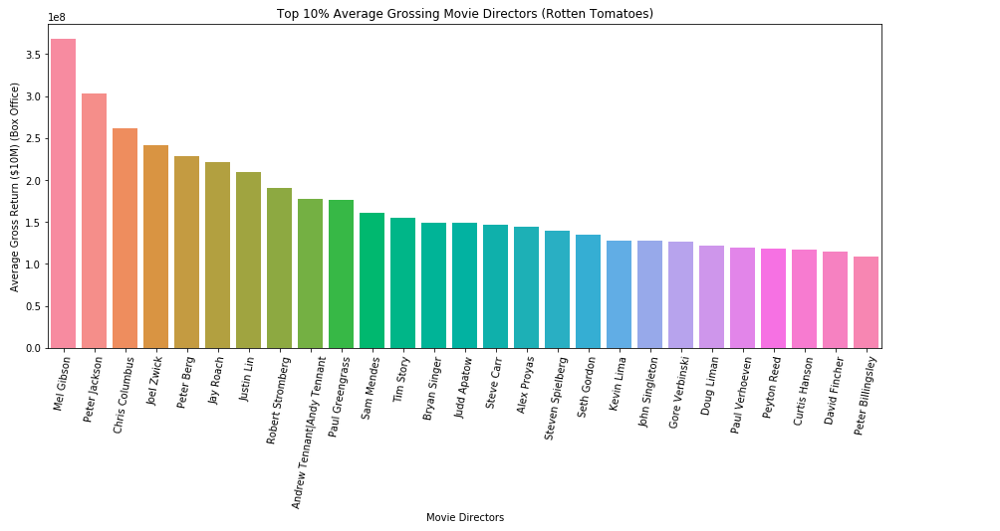
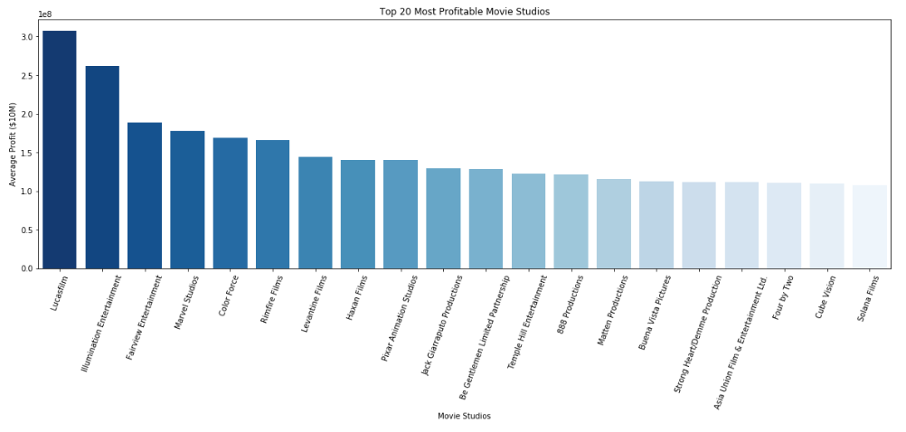
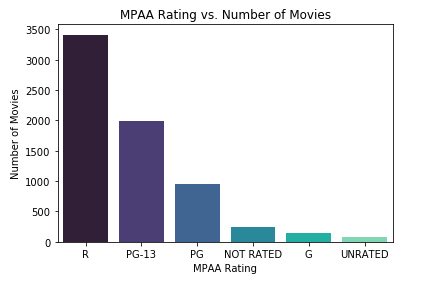
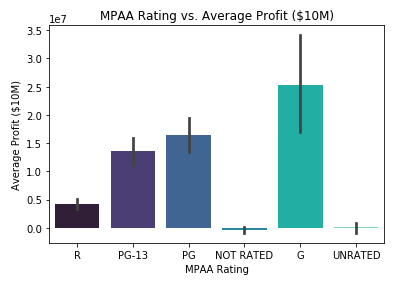
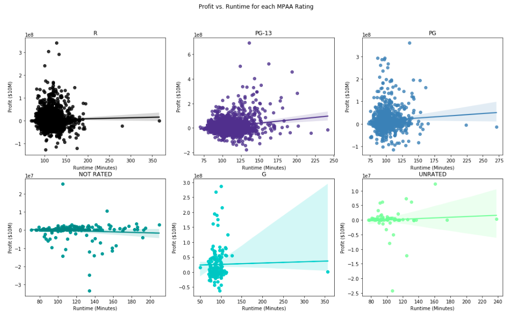
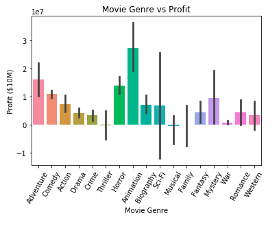

# Microsoft's Potential Entry Into the Video Entertainment Market

#### Authors: Jake Oddi, Mike Rozenvasser

## Business Problem

Microsoft believes there is potential upside in a move into the proprietary entertainment space, similar to those of Netflix and Apple, which have both started producing their own films. Using publicly available movie and industry data, we examine what courses of action should be taken to make this strategic move most successful. 

### Data Cleaning

We were particulary interested in data regarding movie studios, production budget vs. total gross profit, time of entry, and rating. All of these are critical components to a successful entry in a very monopoly-like industry. We focused on data from Box Office Mojo, Rotten Tomatoes, and IMBD. We in addition found a dataset called MovieLens which provided us with data outside of the given recommended datasets. 

##### rt_movie_info is a dataset from Rotten Tomatoes, while kaggle_movies is the MovieLens dataset that has been cleaned and uploaded to kaggle

### Tracking the revenue in the indsutry over the years:
The average worldwide gross in the past 10 years has seen an upward trend that seems to peeking around this year. This is an indication that right now would be a good time to enter the market.

### Best month to release a film:
Entering the market during a dry month could cause consumers to question the quality of film, therefore it is important to enter during the summer months: May, June, July or the holiday months: November, December.

### Profit generated by budget level:
Gross profit and budget level are positively correlated. High budget films drastically outperform low and mid budget films in terms of revenue, thus they should be sought after the most.

### Gathering and Plotting the Top 10% Average Grossing Directors:

 My goal is to select directors whose movies yield returns in the top 10% at the box office on average. I group by directors and their mean box office, and I use sum() to get the total number of directors with 90th percentile returns. This number is 27. I go on again to group the dataset by director and mean box office, though this time sorting values in ascending order, taking the top 27, and assigning the series to a variable top_10pct_box_office. Finally, I employ a barplot to display the mean box office by director. 

The kaggle dataset proves much more useful, as most if not all irregularities have already been removed, and minimal cleaning is required.

### Feature Engineering

We want to look at which movies studios are most profitable on average, which we do by using a groupby function.
We plot the 20 most profitable studios below

Now let's examine the relationship between MPAA rating and profit

 

As we see in the first plot, R rated movies are the most commonly produced, while G rated movies are much less common; however, looking at the second plot, we see G rated movies are the most profitable. This indicates an undersaturation in the market for G rated movies. Microsoft would be best positioned to do well by focusing on producing G rated movies. Taking this line of thinking further, we examined whether shorter or longer movies were more profitable for each rating, focusing on the G rating.

Using built-in regression plots, for all ratings but NOT RATED, there is a very weak positive association between runtime and profit. NOT RATED displays a very weak negative association between runtime and profit

Next, we examined which genre of movie tends to perform the best, measured by how profitable it is.

## Conclusion
Recommendations
* Right now is the best time to enter the movie industry.
     * There has been a significant increase in revenue generated over the past decade and the upward trend is limitless.
     * Microsoft is the third largest tech company, it has the necessary ability to utilize it's assets and make a strong presence during the summer months.        
* Domestic revenue has slightly increased over the past decade as opposed to foreign revenue which has dramatically increased.
     * It is vital to produce movies that appeal to the global audienc just as much as to the domestic one.
* Microsoft should make a big budget action film as it's first point of entry.
     * high budget films are the most profitable and Microsoft has the capacity to produce one.
* Microsoft would be benefit from recruiting a director in the top 10% of average profit of movies he or she was involved in 
* They would benefit from employing one of the top 20 studios measured by profitability

<h4> Most importantly, they are well positioned to take advantage of the imbalance between supply and demand in the market for G rated movies. They can maximize their returns by producing G rated movies that are around 100 minutes long and are of the animated and adventure genres </h4>

## Next Steps

* Given more time, we would have liked to examine the relationship between plot keywords from each movie and their returns.
    * Using more sophisticated models, this approach would be even more effective.
* Given more time, we also would have liked to make API calls and scrape social media sites to measure how popular a movie is on social media compared to its performance at the box office.
* For future work there are many avenues that Microsoft could potentially explore:
    * Should Microsoft produce original movies?
    * How many movies per year should Microsoft release?
    * What affect does social media have on movie performance?

